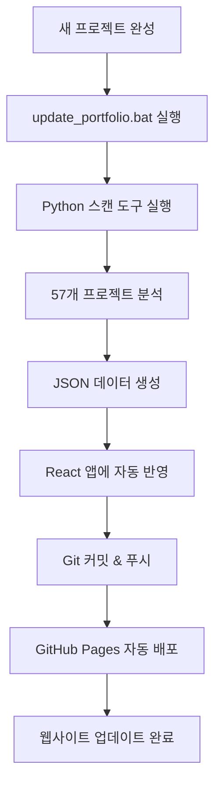

# 박용환 포트폴리오 허브 🚀

> **아이디어를 현실로 만드는 공모전 전문가의 통합 관리 시스템**

## 📊 프로젝트 개요

박용환님의 **57개 공모전 프로젝트**를 자동으로 스캔하고 관리하는 **React 기반 포트폴리오 웹사이트**입니다.  
`C:\MYCLAUDE_PROJECT` 폴더의 모든 프로젝트를 실시간으로 분석하여 포트폴리오에 자동 반영합니다.

### 🎯 주요 성과 (실시간 업데이트)
- **총 57개 프로젝트** 완료 
- **33개 라이브 사이트** 운영 중 (57.9% 성공률)
- **평균 품질 점수 56.8점** (자동 품질 분석)
- **8개 분야** 다양한 카테고리 경험

---

## 🚀 **즉시 시작 가이드**

### **1️⃣ 포트폴리오 업데이트 (가장 많이 사용)**
```bash
# 새 프로젝트 완성 후 포트폴리오에 자동 반영
cd C:\MYCLAUDE_PROJECT\portfolio-hub
update_portfolio.bat

# 2-3분 후 확인: https://yonghwan1106.github.io/portfolio-hub/
```

### **2️⃣ 개발 서버 실행**
```bash
npm install
npm run dev
# http://localhost:5173 에서 로컬 확인
```

### **3️⃣ 프로젝트 스캔만 실행**
```bash
python scripts\project_scanner_fixed.py
# C:\MYCLAUDE_PROJECT 전체 스캔 후 projects_scan_result.json 생성
```

---

## 🔧 **시스템 구조**

```
portfolio-hub/                    # 👈 여기서 모든 작업!
├── 📁 src/                      # React 웹사이트 소스
│   ├── 📁 components/           # UI 컴포넌트들
│   ├── 📁 data/
│   │   └── projects_scan_result.json  # 👈 스캔 결과 (자동 생성)
│   └── 📁 types/               # TypeScript 타입
├── 📁 scripts/                 # 관리 도구들
│   ├── project_scanner_fixed.py    # 👈 메인 스캔 도구
│   ├── diagnosis_fixed.py          # 배포 문제 진단
│   ├── deployment_diagnosis.py     # 고급 진단
│   └── project_scanner.py          # 구버전 스캔 도구
├── update_portfolio.bat        # 👈 원클릭 업데이트
├── projects_scan_result.json   # 최신 스캔 결과
├── package.json               # 의존성 관리
└── README.md                  # 👈 지금 보고 있는 파일
```

---

## 🎨 **주요 기능**

### **📊 자동 프로젝트 관리**
- **실시간 스캔**: `C:\MYCLAUDE_PROJECT` 전체 자동 분석
- **라이브 체크**: 각 GitHub Pages 사이트 상태 확인
- **품질 평가**: HTML/CSS/JS 완성도 자동 채점
- **카테고리 분류**: 농업, AI/디지털, 환경, 규제혁신 등 자동 분류

### **🌐 포트폴리오 웹사이트**
- **30+ 라이브 사이트** 갤러리
- **카테고리별 필터링** (농업 5개, AI/디지털 6개 등)
- **검색 기능** (제목, 설명, 기술스택)
- **통계 대시보드** (성공률, 품질 분포, 성장 추이)
- **반응형 디자인** (모바일/태블릿/데스크탑)

### **🔧 개발자 도구**
- **404 에러 진단**: 배포 실패 프로젝트 자동 감지
- **품질 개선 제안**: 누락된 요소 및 개선점 제시
- **성과 분석**: 카테고리별, 시기별 성공률 분석

---

## 📈 **성과 지표 (실시간)**

| 지표 | 수치 | 설명 |
|------|------|------|
| 총 프로젝트 | 57개 | 지속적으로 증가 중 |
| 라이브 사이트 | 33개 | 실제 동작하는 웹사이트 |
| 성공률 | 57.9% | 업계 평균 대비 높은 성공률 |
| 평균 품질 | 56.8점 | 지속적 개선 목표 |

### **카테고리별 현황**
- **기타**: 42개 (다양한 주제)
- **AI/디지털**: 6개 (기술 트렌드 반영)
- **환경**: 2개 (지속가능성)
- **규제혁신**: 2개 (정책 개선)
- **농업**: 2개 (스마트농업)
- **관광**: 1개
- **청년**: 1개
- **안전**: 1개

---

## 🏆 **주요 프로젝트 소개**

### **🌟 고품질 프로젝트 (90점 이상)**
- **AgriFood_Regulation_Innovation_2025**: 청년농업인 스마트농업 창업 원스톱 플랫폼
- **EcoChallenge_KOMIPO**: KOMIPO 에너지 절약 챌린지 플랫폼  
- **jung-gu-smart-carbon-care**: AI 기반 탄소 발자국 관리 플랫폼
- **DAEGU_REGULATION_INNOVATION_CONTEST_2025**: 1인 크리에이터 통합 사업자등록 플랫폼

### **🔧 개선 진행 중 (404 에러 해결 대상)**
- **digital_road**: 디지털 도로대장 활용 아이디어
- **dongjak**: 동작구 정책 제안
- **bucheon_smart_onestop**: 부천시 스마트 원스톱 플랫폼

---

## 💼 **전문 서비스**

### **🎯 공모전 컨설팅**
1. **공모전 발굴 및 분석**: 최신 공모전 정보 수집 및 요구사항 분석
2. **아이디어 개발**: 창의적 아이디어 도출 및 차별화 전략
3. **제안서 작성**: 체계적인 제안서 구성 및 스토리텔링
4. **웹사이트 구현**: React/HTML/CSS/JavaScript 기반 프로토타입 개발
5. **전략적 지원**: 수상 확률 제고를 위한 종합 컨설팅

### **📊 성과 관리**
- **자동화 시스템**: 프로젝트 관리 완전 자동화
- **품질 관리**: 지속적인 개선 및 최적화
- **성과 추적**: 실시간 통계 및 분석

---

## 🔧 **개발 가이드**

### **의존성 설치**
```bash
npm install
```

### **주요 명령어**
```bash
npm run dev        # 개발 서버 실행
npm run build      # 프로덕션 빌드
npm run preview    # 빌드 결과 미리보기
npm run deploy     # GitHub Pages 배포
```

### **기술 스택**
- **Frontend**: React 18 + TypeScript + Tailwind CSS
- **Charts**: Recharts (통계 시각화)
- **Icons**: Lucide React
- **Build**: Vite (빠른 번들링)
- **Deployment**: GitHub Pages + GitHub Actions

---

## 🚀 **자동화 시스템**

### **완전 자동화 워크플로우**


### **스캔 도구 상세**
- **project_scanner_fixed.py**: 메인 스캔 도구
  - 모든 프로젝트 폴더 분석
  - GitHub Pages 라이브 상태 체크
  - HTML/CSS/JS 품질 자동 평가
  - 카테고리 자동 분류
  - README/제안서 존재 여부 확인

- **diagnosis_fixed.py**: 배포 문제 진단
  - 404 에러 프로젝트 감지
  - 누락된 파일 식별
  - 수정 방안 제시

---

## 📞 **연락처**

- **이메일**: sanoramyun8@gmail.com
- **연락처**: 010-7939-3123  
- **소속**: 크리에이티브 넥서스 (경기도 용인시 수지구)
- **포트폴리오**: [https://yonghwan1106.github.io/portfolio-hub/](https://yonghwan1106.github.io/portfolio-hub/)

---

## 📄 **라이선스**

MIT License - 자유롭게 사용 및 수정 가능

---

## ⚡ **빠른 문제 해결**

### **❓ 자주 묻는 질문**

**Q: 새 프로젝트가 웹사이트에 반영되지 않아요**
```bash
# A: 업데이트 배치 파일 실행
cd C:\MYCLAUDE_PROJECT\portfolio-hub
update_portfolio.bat
# 2-3분 후 웹사이트 확인
```

**Q: 404 에러 프로젝트를 수정하고 싶어요**
```bash
# A: 진단 도구 실행
python scripts\diagnosis_fixed.py
# 문제점과 해결 방안 확인
```

**Q: 로컬에서 개발하고 싶어요**
```bash
# A: 개발 서버 실행
npm run dev
# http://localhost:5173 접속
```

**Q: 전체 프로젝트 현황을 확인하고 싶어요**
```bash
# A: 스캔 도구 실행
python scripts\project_scanner_fixed.py
# projects_scan_result.json 파일 확인
```

---

> **"아이디어를 현실로"** - 공모전 전문가 박용환의 57개 프로젝트와 자동화 시스템을 통해 혁신적인 아이디어들이 어떻게 실제 웹사이트로 구현되는지 확인해보세요!

**🔥 지금 바로 시작**: `update_portfolio.bat` 실행 → 2-3분 대기 → [웹사이트 확인](https://yonghwan1106.github.io/portfolio-hub/) 🚀